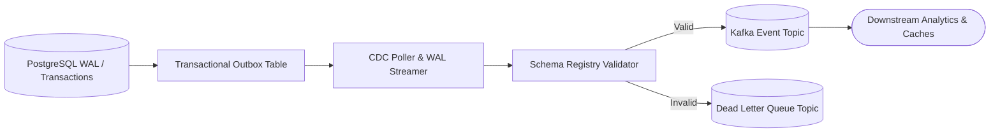

# 🌊 Event Stream CDC

```mermaid
flowchart LR
    PG[(PostgreSQL WAL / Transactions)] --> Outbox[Transactional Outbox Table]
    Outbox --> CDC[CDC Poller & WAL Streamer]
    CDC --> Schema[Schema Registry Validator]
    Schema -- Valid --> Kafka[(Kafka Event Topic)]
    Schema -- Invalid --> DLQ[(Dead Letter Queue Topic)]
    Kafka --> Consumers([Downstream Analytics & Caches])
```

Real-time Change Data Capture (CDC) engine with Transactional Outbox pattern in Python.